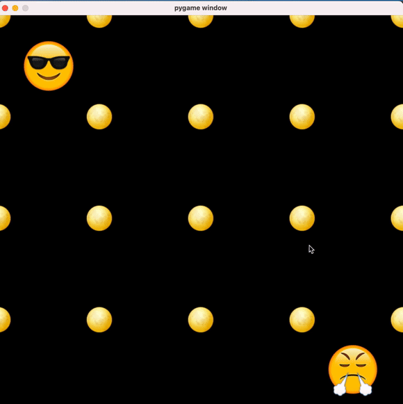

# EmojiBombers
This is a game inspired by the classic Bomberman. It implements multiplayer functionality using TCP sockets.

The software has two parts, a client and a server.

## Server
To run the server you need golang installed.
After that you navigate to the server/ folder and enter the command ```go run *.go```. The server will then be up and running and listening to port 8080. You can change the port by changing the line ```	ln, err := net.Listen("tcp", ":8080")```.

## Client
To run the client you need Python 3 and pygame installed. At that point you can simply start the client with the command ```python3 client.py```. You can change what ip you want to connect to by changing the line ```s.connect(("127.0.0.1", 8080))```. You need to start the server before the client.

## Gameplay

